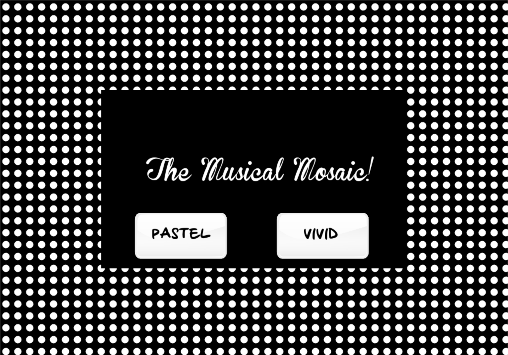
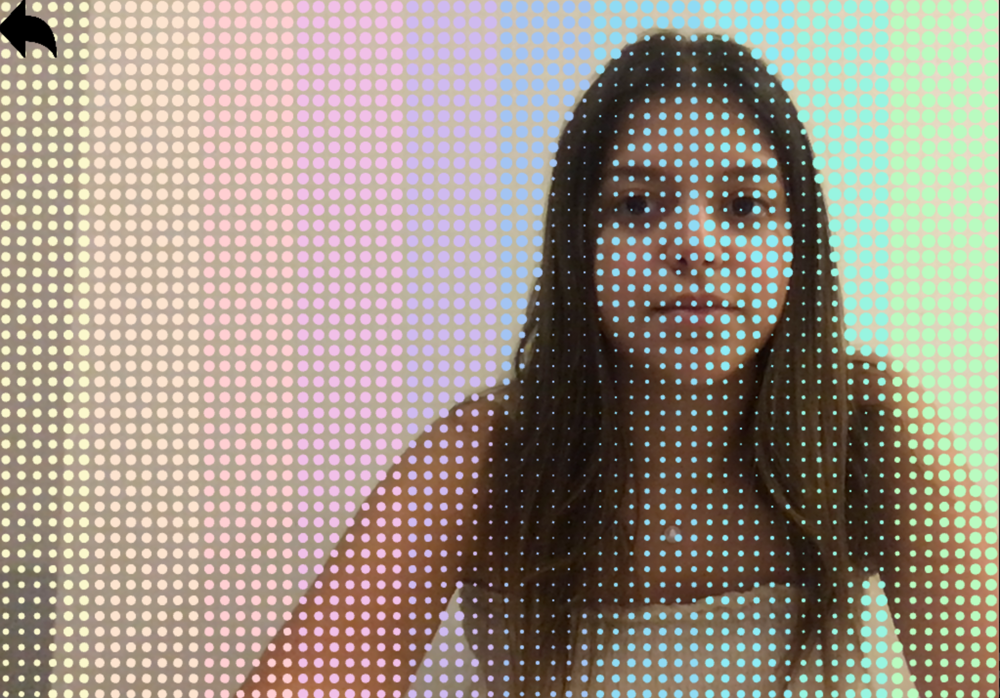
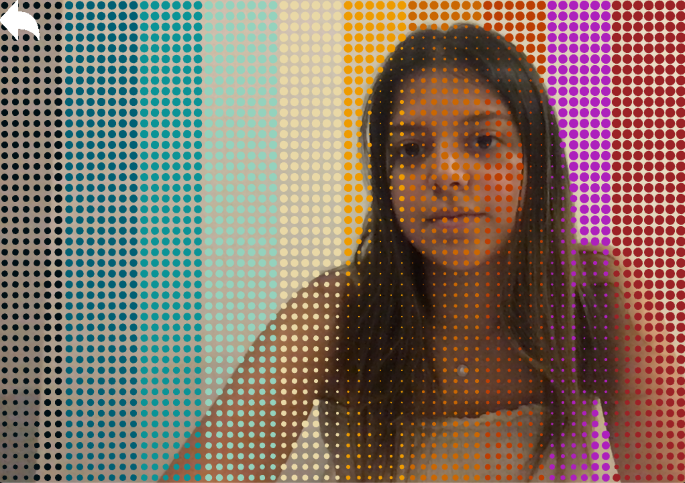

# The Musical Mosaic

## Description
For this project, I wanted to work with something new that I haven't previously worked with when using OpenFrameworks. I decided that I wanted to use the webcam and have the user interact with the screen and so I was inspired by the installations in front of the IM lab. On the home page, the user is shown the title and an interactive black and white visual with two buttons, one for a pastel/piano calm theme, and one for a vivid/drums noisy theme. Below is an image of the main screen.



Depending on the button that they click, they will be redirected to one of the following themes, where the colors and audio notes vary with movement and darkness in front of the screen. Below are screenshots for both.

### The Forest Theme
Pastel                    |          Vivid          
:-------------------------:|:-------------------------:
  |  

## Algorithm 
The first thing I did was setup the webcam and run it to make sure that it's working. Next, I worked on the pastel/piano theme to make sure that the implementation would not be an issue, and for the mosaic changing in size, I followed along with Lewis Lepton's [Mosaic Circles](https://www.youtube.com/watch?v=Eiu46lT32gc&t=54s) video. This was mainly a nested for loop that consisted of the following lines, where the radius of the circle is based on the brightness of that specific pixel on the screen, obtained from the camera.  

```
      color = webcam.getPixels().getColor(i, j);
      brightness = color.getBrightness();
      radius = ofMap(brightness, 0, 255, 0, 8);
      ofDrawCircle(i, j, radius);
```
Next, I started working on the pastel theme with the audio as this was my initial plan. I went on [Coolors](https://coolors.co/) and looked through different palettes until I found one that I liked and matched the theme I was going for. I then went back to the code and inside the nested for loops set the color based on its location on the screen. I divided the screen into 10 sections that were based on if-statements that specify the starting point in the width to the endpoint, each being a tenth of the screen, and for each one, I set its respective color based on the color scheme that I chose. Next, I went on a website called [Sample Focus](https://samplefocus.com/tag/piano-note) where I picked out 10 piano notes that I would like to have on my installation and assigned each note to one of the segments that I have, and for this theme, I tried to make the sounds go together in order from one side to another. I then played around and tested out different radius sizes to decide on when exactly I would want the musical note to start and the radius that I reached was 0.5, meaning when the brightness is very low. I then had an issue that the sounds would never finish and would always keep restarting before the note can even be heard because it is inside the draw loop. To fix that, I was looking for ways to have it run completely before running again until I came across the .isPlaying() function and so my condition for the music to play ended up being as follows:

```
        if (radius < 0.5 and sound1.isPlaying() == 0){
            sound1.play();
        }
```

I had another issue with the audios that I got and that they took longer than I wanted them to before starting again as the last part of each note was silent and so I went through the 10 audios, trimmed them, and reuploaded them. After some trial and error and reaching the final product that I am satisfied with, I went ahead and started working on the other theme, the vivid/drums theme where I went through the same process. I went on Coolors once again, picked out the palette that I wanted, got audios for the drums, and added them all to the code in the same way. For this theme, I meant to have it as dissonant or noisy, opposite from the pastel/piano theme.

When I finished the 2 themes I started working on the story and flow. The code is divided into 3 modes; mode 0 is the landing page, mode 1 is the pastel/piano theme and mode 2 is the vivid/drums theme. For the landing page, I created a visual that's similar to the mosaic by having 2 nested for loops and I updated the radius in the update function so also have some kind of motion or interactivity. I then added some shapes, text, and buttons to introduce the installation and buttons to go into the different themes. At first I had them as buttons and checked to see if the mouse was clicked inside it but then changed them to images as they looked more aesthetically pleasing and checked to see where the mouse was clicked and switched to the respective mode based on that. I noticed a bug later on that when it's on mode 1 or 2 and the screen is clicked on the button area, that the mode will also change and so I added an if statement to ensure that this only happens on mode 0, or the landing page. Below is an example for the mouseReleased() function to lead to the pastel theme.

```
    else if((x >= (screenWidth/4 + 10) && x <= screenWidth/4 + 210) && (y >= screenHeight/1.7 && screenHeight/1.7 + 100)){
        if(mode == 0){
            mode = 1;
        }
    }
```

Lastly, I set up back buttons to lead back to the landing page if a user wants to go into the other theme.

## Evaluation
Overall, I really like how it played out and I am very satisfied with how the colors for both themes go together. I also feel like having one of the themes as consonant and calm while the other is dissonant and noisy gives it some diversity. If I were to do something different, however, I would have changed it to be based on the movement rather than the brightness. 
